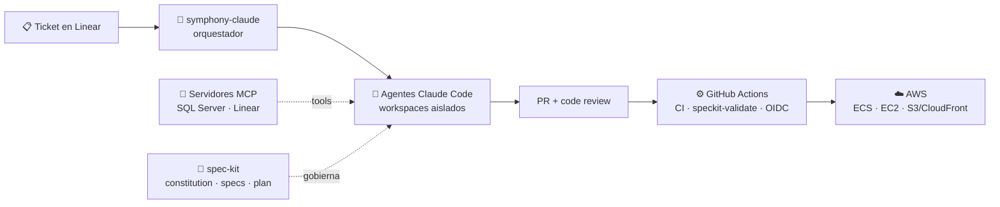

## 👋 Sobre mí

Soy **Coordinador de Proyectos y Tech Lead** en **Galilei Smart Solutions**: lidero el equipo técnico que construye el ecosistema completo de la empresa — web, móvil, APIs e infraestructura — y donde más invierto hoy es en **integrar IA de verdad en el ciclo de desarrollo y en el producto**: agentes autónomos, servidores MCP propios y desarrollo dirigido por especificaciones.

También estudio Medicina, y me gusta el cruce entre software y salud (de ahí [medi-dosis](https://github.com/ejmontana/medi-dosis)).

---

## 🤖 Ingeniería de IA

### Agentes autónomos

- **symphony-claude** — orquestador de agentes de larga duración: hace polling de **Linear** y despacha sesiones autónomas de **Claude Code** en workspaces aislados que implementan el ticket, abren el PR, atienden el code review y mergean. Concurrencia en dos niveles, reintentos con backoff exponencial, detección de stalls, pool SSH para ejecución distribuida, TUI propia de monitoreo y contabilidad de tokens/costo por sesión. **144 tests.**
- **Equipos multi-agente** en repos de producción: hasta 9 agentes especializados (arquitecto, revisor, tester, auditor de seguridad, DevOps) con flujo `spec → implement → test → security-audit → review → merge`.

### Model Context Protocol (MCP)

- **mcp-sqlserver** — servidor MCP de grado producción para SQL Server, publicado como paquete npm del equipo: 7 tools, clasificación de sentencias seguras/peligrosas con confirmación explícita, preview de filas afectadas, **auditoría automática en BD y backup previo de cada cambio**, modo readonly y multi-base de datos.
- **symphony-linear** — MCP server stdio que da a cada agente acceso a la API GraphQL de Linear sin exponer credenciales en el prompt.

### IA en producto

- **Triage de tickets de helpdesk con Gemini**: genera título, prioridad, módulo afectado y queries de diagnóstico sugeridas, con contexto real del negocio inyectado desde la BD.
- **Chatbot empresarial con tool-calling** de solo lectura sobre BD multi-tenant (Vercel AI SDK + Gemini, streaming): límite diario de tokens, rate limiting, sanitización de entrada y esquema inyectado solo en el primer mensaje.
- **Bots conversacionales multicanal**: recordatorios por lenguaje natural en Telegram (DeepSeek), respuestas con voz sintetizada (ElevenLabs) e imágenes (DALL·E), y chat por streaming contra un **LLM self-hosted** (Llama vía Ollama).

### Spec-Driven Development

- **spec-kit** adoptado en 6+ repos del equipo: constitución vinculante por repo, ciclo `specify → plan → tasks → implement`, y un workflow de CI (`speckit-validate`) que hace **enforcement automático en cada PR**.
- Escribí las **guías y el playbook de adopción** para el equipo; también aplico **AWS AI-DLC** para ingeniería inversa y migración planificada de sistemas legacy.

---

## ☁️ AWS e Infraestructura como Código

Migración real on-prem → AWS por fases, con **Terraform** modular (12 módulos, 11 stacks con state independiente y blast radius controlado):

- **Cómputo**: ECS Fargate, ECR, EC2 Windows/IIS, Application Auto Scaling
- **Red y entrega**: VPC, ALB, S3 + CloudFront (con CloudFront Functions), Route 53, ACM, VPN site-to-site
- **Datos**: RDS for SQL Server — migración nativa por backup/restore desde S3, **cutover < 15 min** con runbooks
- **Seguridad**: WAF (managed rules + rate limit), Secrets Manager, IAM con **OIDC de GitHub Actions** — cero credenciales de larga vida en CI/CD
- **Operación**: CloudWatch (alarmas), SNS, SES v2 con DKIM/SPF, AWS Budgets, bitácora y runbooks de cutover

---

## 🛠️ Stack

**Backend & APIs**

**Cloud & DevOps**

**Frontend & Mobile**

**Datos & Plataformas**

 

---

## 🏢 Lo que construyo en Galilei

Como coordinador, lidero el desarrollo de un ecosistema empresarial completo:

| Producto | Qué es | Stack |
|---|---|---|
| **Gali360 / GaliSuite Web** | Back-office comercial y financiero multi-tenant con chatbot IA integrado | Next.js 16 · Supabase · Arquitectura Hexagonal + DDD |
| **GaliSales** | App móvil de ventas en campo: pedidos, cobranza, GPS tracking en background | React Native · Expo · EAS · Clean Architecture |
| **Gali BI** | App móvil de Business Intelligence con motor de KPIs estilo DAX | Expo · Supabase · RLS endurecido |
| **ERP web** | 16 módulos de negocio (facturación, cartera, bancos, logística…) | React · .NET Web API · SQL Server |
| **Hub bancario** | Conciliación de pagos multi-banco: webhooks con HMAC-SHA256, OAuth2, auto-conciliación | .NET 9 · N-Capas · multi-tenant |

**Integraciones empresariales**: SAP → ERP, puente REST para Microsoft Dynamics GP, WhatsApp Flows de Meta (cifrado RSA-OAEP + AES-GCM), y suites de addons custom para **Odoo 18** (POS, moneda dual, eCommerce con checkout por WhatsApp).

> El código de estos proyectos es privado por acuerdos de confidencialidad. Los detalles de arquitectura los cuento con gusto en una entrevista.

---

## 📌 Proyectos públicos

| Proyecto | Qué resuelve | Stack |
|---|---|---|
| **[medi-dosis](https://github.com/ejmontana/medi-dosis)** | Calculadora de dosificación con validación de fármacos de alto riesgo · [demo](https://medi-dosis.vercel.app) | React 19 · Zod |
| **[crud-user-admin](https://github.com/ejmontana/crud-user-admin)** | Full stack: API REST con JWT, carga de archivos y asistente con IA | Express · TS · SQL Server |
| **[portalCautivo](https://github.com/ejmontana/portalCautivo)** | Portal cautivo WiFi con panel de administración | React · TS |
| **[PortafolioV2](https://github.com/ejmontana/PortafolioV2)** | Portafolio profesional | Astro 5 |
| **[simulacion-newton](https://github.com/ejmontana/simulacion-newton)** | Simulación de las leyes de Newton · [demo](https://simulacion-newton.vercel.app) | React |

---

## 📊 GitHub

---

## 📫 Contacto

 

  

<i>💻 "Leading teams, building complete solutions, shipping AI that works." </i>

